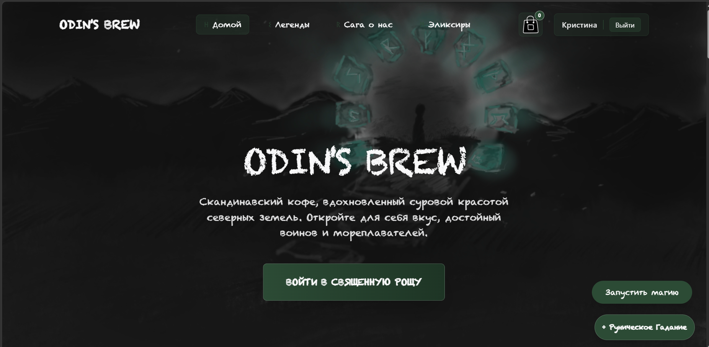
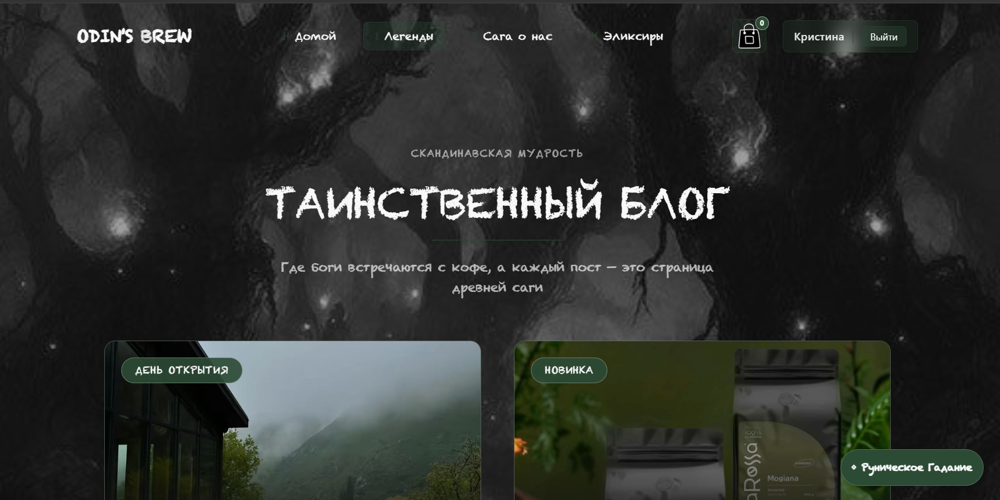
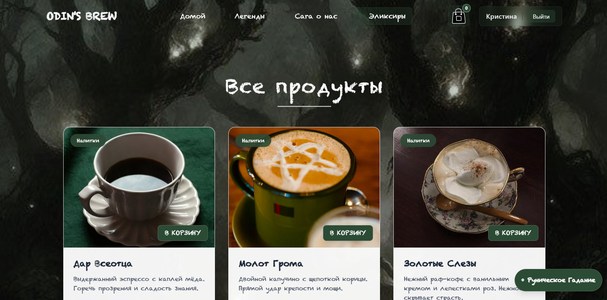

# ODIN’S BREW ☕

Веб-сайт кофейни в скандинавском стиле

## Описание проекта

В современном городском пространстве кофейни играют важную социальную и культурную роль, становясь не просто местом покупки напитков, но и пространством для общения, отдыха, работы и творчества. Скандинавские кофейни ассоциируются с минимализмом, уютом и атмосферой, где большое значение придаётся визуальной эстетике и пользовательскому опыту.

Данный проект представляет собой полнофункциональный веб-сайт кофейни в скандинавском стиле, разработанный с использованием современного технологического стека React + Node.js + SQLite3. Сайт предоставляет пользователям удобный интерфейс для просмотра каталога продукции, работы с корзиной, чтения блога и взаимодействия с брендом, а администраторам — инструменты для управления контентом и анализа продаж.

Проект реализован в формате SPA (Single Page Application) с клиентской маршрутизацией и REST API.

## Демо





## Цель и задачи проекта
**Цель проекта**

Изучение и практическое применение технологического стека React, Node.js и SQLite3 для создания профессионального веб-сайта кофейни с акцентом на UI/UX-дизайн и удобство использования.

**Задачи проекта**
 - анализ предметной области кофейного бизнеса;
 - проектирование архитектуры веб-приложения;
 - разработка фронтенда на React;
 - разработка бэкенда на Node.js;
 - проектирование и реализация базы данных SQLite3;
 - реализация функциональных модулей:
 - каталог товаров;
 - корзина;
 - блог;
 - регистрация и авторизация;
 - панель администратора;
 - страница статистики и аналитики;
 -тестирование и публикация проекта.

## Методы исследования
 - анализ литературы и онлайн-источников;
 - практическое тестирование технологий;
 - проектирование архитектуры и БД;
 - сравнительный анализ стека.

## Функционал
**Пользователь:**
 - просмотр каталога товаров
 - добавление товаров в корзину
 - оформление заказа
 - регистрация и авторизация
 - просмотр блога

**Администратор:**
 - управление товарами
 - управление контентом
 - просмотр статистики продаж
 - аналитика

**Особенности:**
 - генерация чеков
 - drag-and-drop система стикеров
 - изуализация данных (графики, таблицы)

## Технологический стек
  **Frontend**
 - React
 - Vite
 - React Router
 - Ant Design
 - Tailwind CSS
 - Framer Motion
 - Axios / Fetch
 - Recharts
 
 **Backend**
 - Node.js
 - Express
 - SQLite3

## Архитектура проекта

Проект построен по клиент-серверной архитектуре:

Frontend (React SPA) - Backend (Node.js API) - SQLite база данных

## Роль в проекте

**Выполненные задачи:**

 - разработка backend-части на Node.js (Express API)
 - проектирование и реализация базы данных SQLite3
 - настройка взаимодействия frontend - backend
 - реализация логики заказов и пользователей
 - разработка системы чеков
 - реализация drag-and-drop механики стикеров
 - разработка дашбордов и визуализации данных (графики, таблицы)

## Что решает проект

**Проект демонстрирует создание полноценного веб-сервиса для бизнеса:**

 - автоматизация работы с заказами
 - удобное взаимодействие пользователя с продуктом
 - аналитика и визуализация данных для администратора
 - объединение frontend и backend в единую систему

## Практикуемые навыки

 - разработка REST API
 - работа с БД
 - проектирование архитектуры приложения
 - клиент-серверное взаимодействие
 - работа с drag-and-drop интерфейсами
 - визуализация данных (charts, dashboards)
 - работа с React и современным frontend-стеком

## Структура проекта
```
ODIN-S-BREW/
├── HTML/my-react-app/        # frontend (React)
│   ├── src/
│   │   ├── components/
│   │   ├── pages/
│   │   ├── stores/
│   │   └── main.jsx
│   └── package.json
├── Web-Application/backend/  # backend (Node.js)
│   ├── server.js
│   ├── database.js
│   ├── database.db
│   └── routes/
├── images/
└── README.md
```

## Запуск проекта

**1. Клонирование репозитория**
```
git clone https://github.com/Kirikiri2/ODIN-S-BREW.git
cd ODIN-S-BREW
```
**2. Запуск backend**
```
cd Web-Application/backend
npm install
npm start
```
**3. Запуск frontend**
```
cd ../../HTML/my-react-app
npm install
npm run dev
```
**5. Открыть в браузере**

http://localhost:5173

## Аутентификация и роли

user — обычный пользователь
admin — администратор с расширенными правами

**Данные админа:**
 - Логин: admin@gmail.com
 - Пароль: admin0000

---

## Итог

Проект демонстрирует использование современного fullstack-стека для создания веб-приложений:

 - объединение frontend и backend
 - работа с реальными пользовательскими сценариями
 - создание интерфейсов с высокой степенью интерактивности


